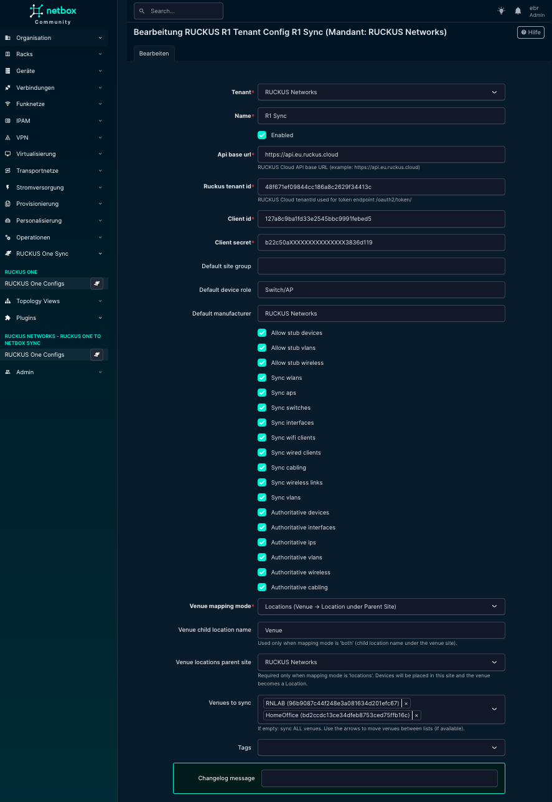
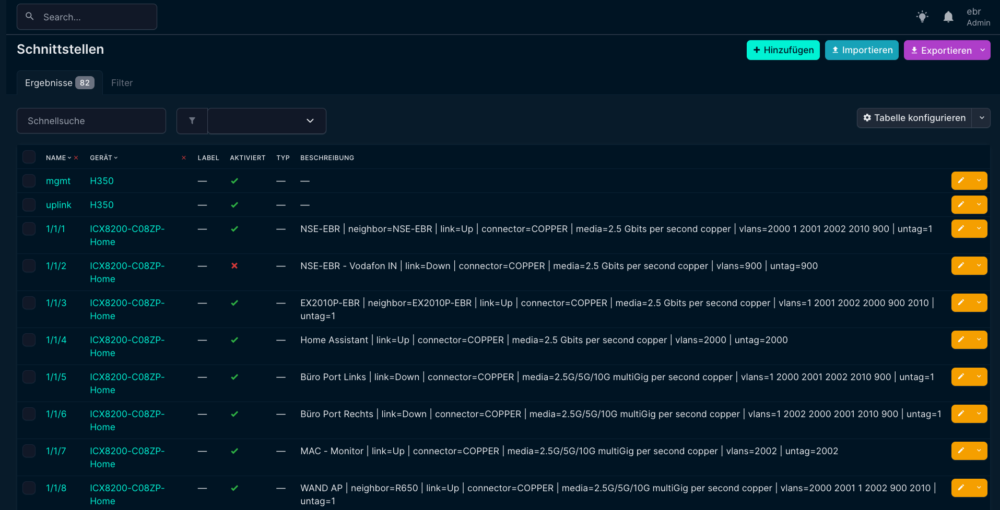
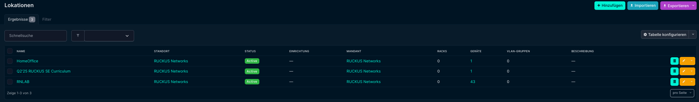
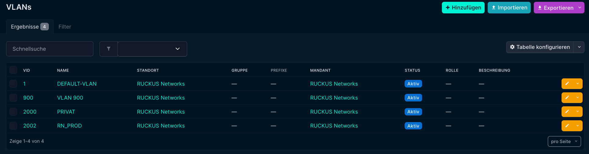
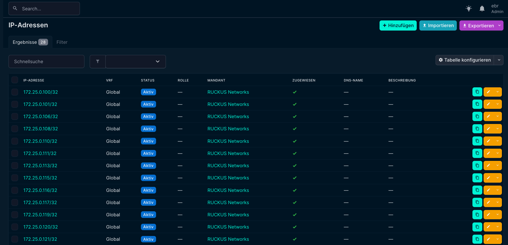
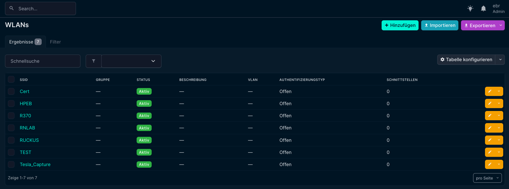
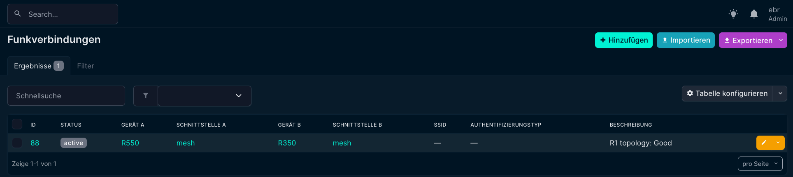

# NetBox RUCKUS One Sync Plugin

The **NetBox RUCKUS One Sync Plugin** synchronizes inventory and network data from **RUCKUS One (Cloud)** into **NetBox** and establishes RUCKUS One as an authoritative *Source of Truth* for Wi‑Fi and switching infrastructures.

The plugin is built for **system integrators, operators, and vendor SEs** who want a clean, automated, and enterprise‑ready documentation of RUCKUS environments inside NetBox.

---

## ✨ Features

### 🔄 Synchronization Scope
- Venues
- Sites and Locations (flexible mapping)
- Access Points
- Switches
- Interfaces and cabling
- VLANs (including names from `vlanUnions`)
- WLANs / SSIDs
- Wired and wireless clients
- Wireless links

### 🗺️ Venue Mapping Modes
- **sites** – Each venue becomes a NetBox *Site*
- **locations** – Each venue becomes a *Location* under a predefined parent Site
- **both** – Site plus child Location per venue

### 🏷️ Authoritative Sync
RUCKUS One can be authoritative per object type:
- Devices
- Interfaces
- VLANs
- Wireless
- Cabling
- IP addresses

Existing NetBox objects are **updated instead of duplicated**, including renames.

### 🎯 Selective Venue Sync
- Sync **all venues**, or
- Select specific venues using a dual‑list selector in the UI

---

## 🖼️ Screenshots

### Plugin Configuration


### Tenant Configuration (Detail)


### Tenant Configuration (Edit)


### Devices


### Interfaces


### Interface Connections


### Cabling


### Locations


### VLANs


### IP Addresses


### Wireless LANs


### Wireless Links


---

## 📦 Installation

### Requirements
- NetBox ≥ 4.0
- Python ≥ 3.10
- RUCKUS One Cloud tenant

---

### 🔧 Installation (netbox-docker)

```bash
cd netbox-docker/plugins
git clone https://github.com/<your-org>/netbox-ruckus-r1-sync.git
```

Enable the plugin in `configuration/plugins.py`:

```python
PLUGINS = [
    "ruckus_r1_sync",
]
```

Build and start NetBox:

```bash
docker compose build
docker compose up -d
docker compose exec netbox python manage.py migrate
```

---

### 🔧 Installation (Bare-Metal NetBox)

```bash
source /opt/netbox/venv/bin/activate
pip install netbox-ruckus-r1-sync
```

Enable the plugin and run migrations:

```bash
python manage.py migrate
python manage.py collectstatic --no-input
```

---

## ⚙️ Configuration

1. Navigate to **Plugins → RUCKUS R1 Sync**
2. Create a **Tenant Configuration**
3. Configure:
   - API Base URL (e.g. `https://api.eu.ruckus.cloud`)
   - Client ID / Client Secret
   - Venue mapping mode
   - Sync and authoritative options
4. Click **Refresh Venues**
5. (Optional) Select specific venues
6. Run **Sync**

---

## 📄 License

This project is licensed under the **Apache License, Version 2.0**.  
See the `LICENSE` file for details.
