# NetBox RUCKUS One Sync Plugin

The **NetBox RUCKUS One Sync Plugin** synchronizes inventory and network information from **RUCKUS One (Cloud)** into **NetBox**, establishing RUCKUS One as an authoritative *Source of Truth* for WLAN and switching infrastructures.

The plugin is designed for **system integrators, operators, and vendor SEs** who want to document RUCKUS environments in NetBox in a clean, automated, and enterprise-ready way.

---

## ✨ Features

### 🔄 Synchronization
- Venues
- Sites and Locations (flexible mapping)
- Access Points
- Switches
- Switch ports as `dcim/interfaces`
- Interfaces and cabling (idempotent, optionally authoritative)
- VLANs (rename-safe, sourced from `/venues/{venueId}/switchProfiles/vlans`)
- WLANs / SSIDs incl. VLAN, encryption, and PSK
- Wired and wireless clients
- IP addresses (interface-bound for wired clients)
- Wireless links

### 🗺️ Venue Mapping
- **sites** – Venue becomes a NetBox Site
- **locations** – Venue becomes a Location under a parent Site
- **both** – Site plus child Location

### 🏷️ Authoritative Sync
RUCKUS One can act as an authoritative source per object class:
- Devices
- Interfaces
- VLANs
- Wireless (WLANs & clients)
- Cabling
- IP addresses

Existing objects are **updated instead of duplicated**, including renames.

### 🎯 Selective Venue Sync
- Synchronize all venues, or
- Select specific venues via a dual-list selector

---

## 🖼️ Screenshots

### Plugin Configuration
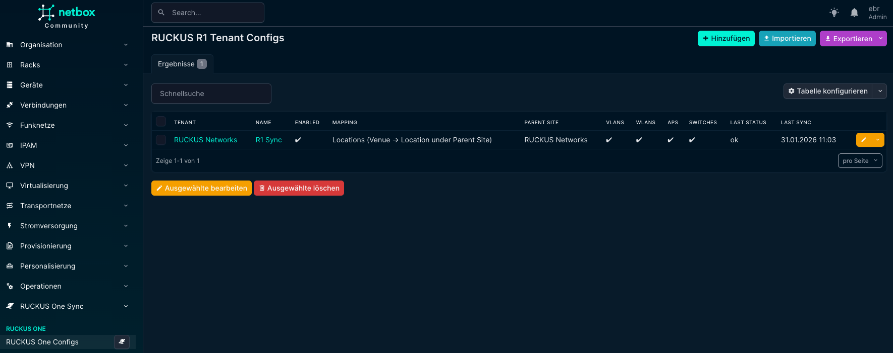

### Tenant Configuration (Detail)
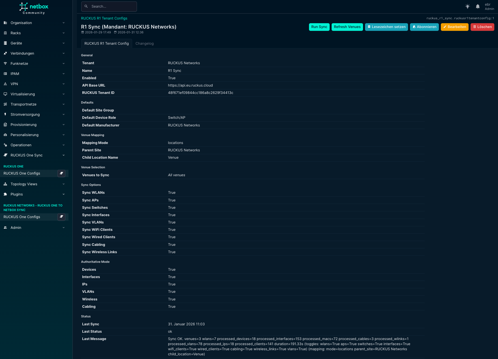

### Tenant Configuration (Edit)
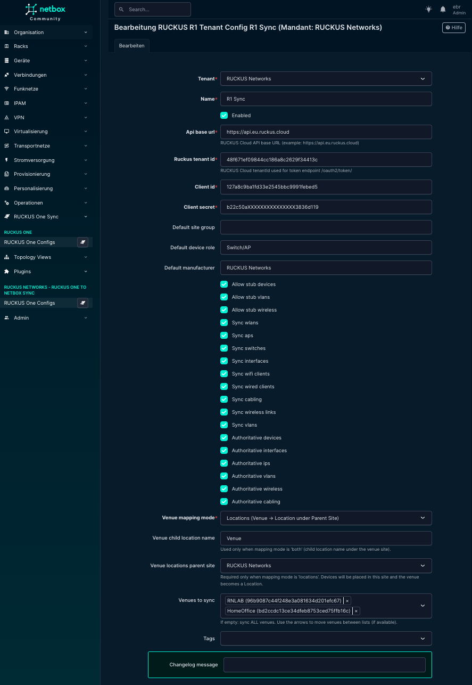

### Devices
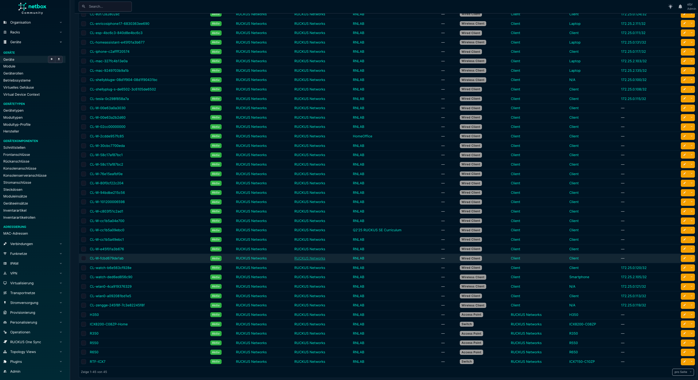

### Interfaces
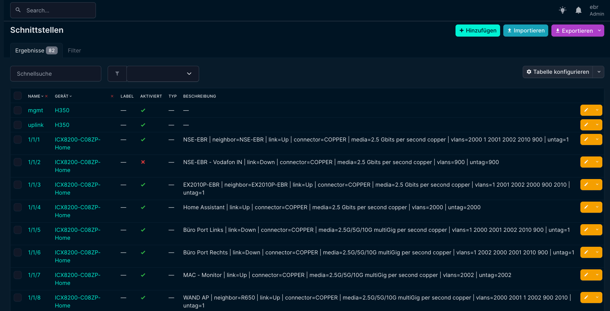

### Interface Connections
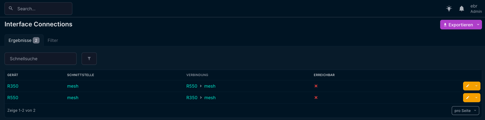

### Cabling
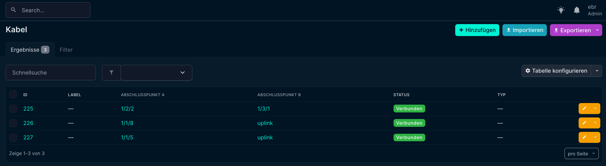

### Locations
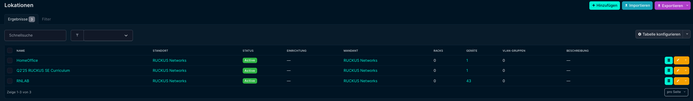

### VLANs
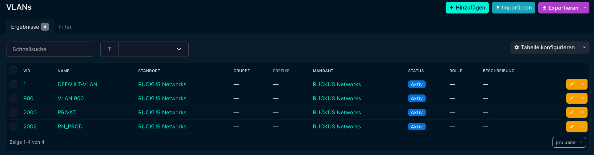

### IP Addresses
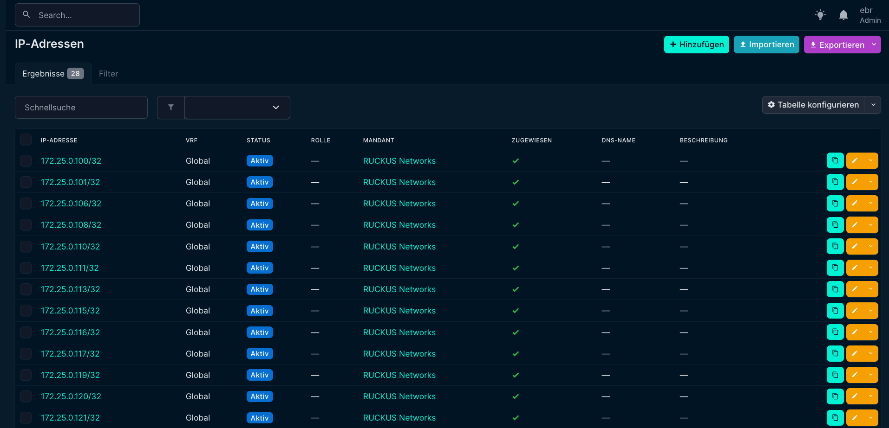

### Wireless LANs
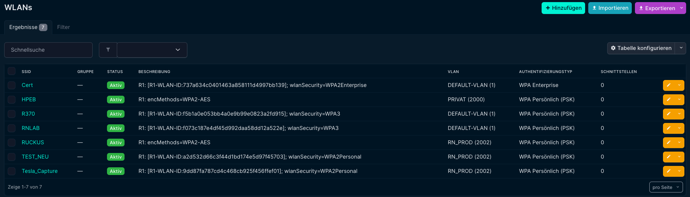

### Wireless LAN – Details
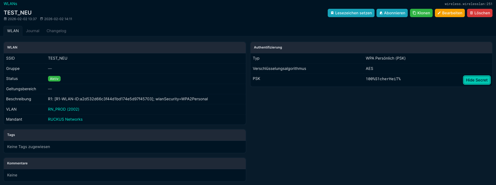

### Wireless LAN – Changelog
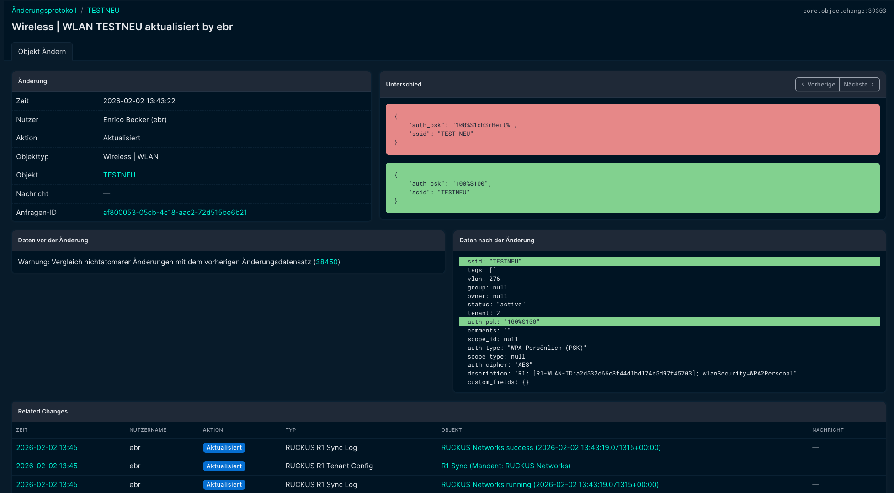

### Wireless Links
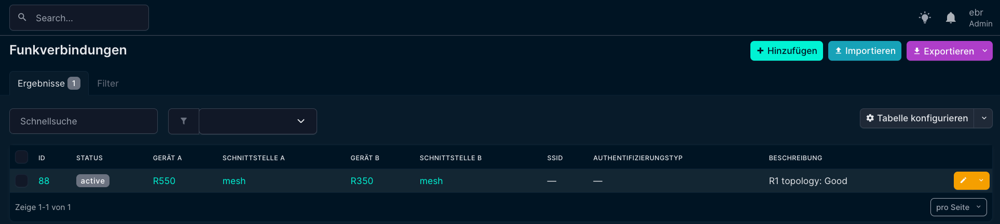

---

## 📦 Installation

### Requirements
- NetBox ≥ 4.0
- Python ≥ 3.10
- RUCKUS One Cloud tenant

---

### 🔧 Installation with netbox-docker

```bash
cd netbox-docker/plugins
git clone https://github.com/<your-org>/netbox-ruckus-r1-sync.git
```

Enable the plugin in `configuration/plugins.py`:

```python
PLUGINS = [
    "ruckus_r1_sync",
]
```

Build and start NetBox:

```bash
docker compose build
docker compose up -d
docker compose exec netbox python manage.py migrate
```

---

### 🔧 Classic Installation

```bash
source /opt/netbox/venv/bin/activate
pip install netbox-ruckus-r1-sync
python manage.py migrate
python manage.py collectstatic --no-input
```

---

## ⚙️ Configuration

1. Navigate to **Plugins → RUCKUS R1 Sync**
2. Create a tenant configuration
3. Configure API credentials and mapping options
4. Load venues from RUCKUS One
5. Start the synchronization

---

## 🗺️ Roadmap
- Integration of **RUCKUS EDGE**
- Integration of **RUCKUS IoT Controller**
- Integration of **RUCKUS WAN Gateway**

---

## 📄 License

This project is licensed under the **Apache License, Version 2.0**.  
See the `LICENSE` file for details.
